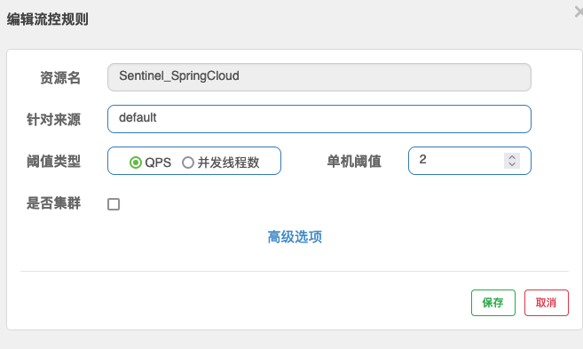
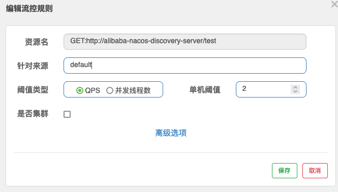
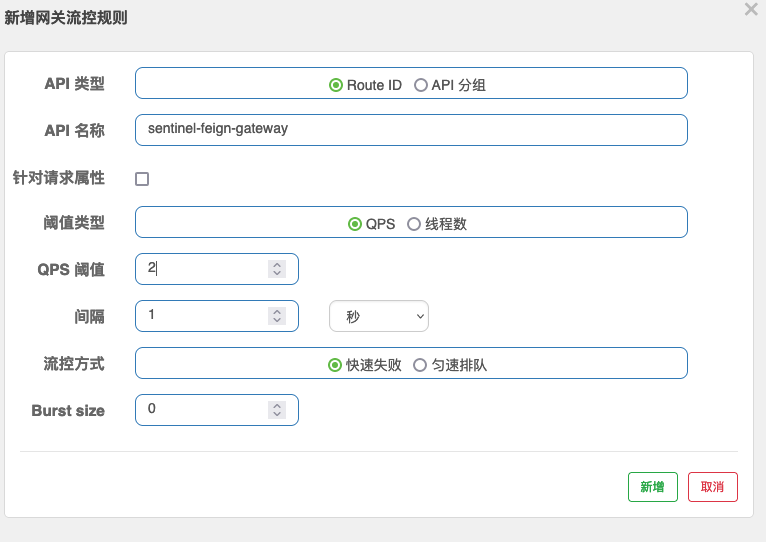
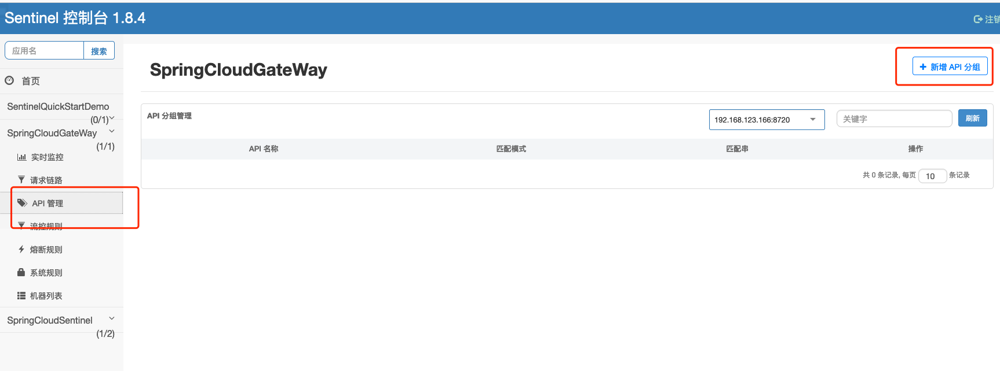
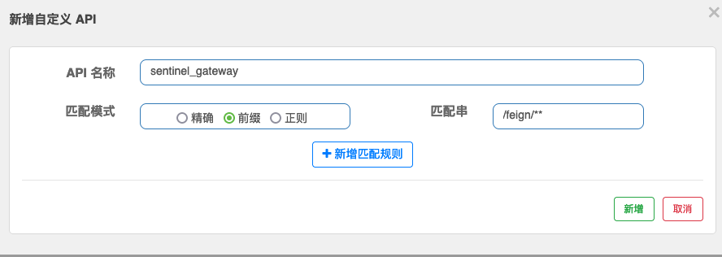
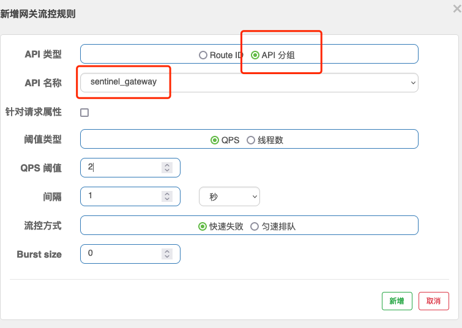

# SpringCloud+Sentinel

## 版本参考地址

[SpringCloud](https://spring.io/projects/spring-cloud)

[SpringCloud Alibaba](https://spring.io/projects/spring-cloud-alibaba)

[SpringCloud Alibaba 版本对应关系](https://github.com/alibaba/spring-cloud-alibaba/wiki/%E7%89%88%E6%9C%AC%E8%AF%B4%E6%98%8E)

[SpringCloud版本详细对应关系](https://github.com/spring-projects/spring-cloud/wiki/Spring-Cloud-Greenwich-Release-Notes)

[Nacos-SpringCloud版本](https://nacos.io/en-us/docs/quick-start-spring-cloud.html)

## 步骤

* springcloud 版本

  ```text
   <dependencyManagement>
          <dependencies>
              <dependency>
                  <groupId>org.springframework.cloud</groupId>
                  <artifactId>spring-cloud-dependencies</artifactId>
                  <version>Greenwich.RELEASE</version>
                  <type>pom</type>
                  <scope>import</scope>
              </dependency>
              <dependency>
                  <groupId>com.alibaba.cloud</groupId>
                  <artifactId>spring-cloud-alibaba-dependencies</artifactId>
                  <version>2.1.2.RELEASE</version>
                  <type>pom</type>
                  <scope>import</scope>
              </dependency>
          </dependencies>
      </dependencyManagement>
  ```

  

* pom 加入sentinel依赖

  ```text
          <dependency>
              <groupId>com.alibaba.cloud</groupId>
              <artifactId>spring-cloud-starter-alibaba-sentinel</artifactId>
              <version>2.1.0.RELEASE</version>
          </dependency>
  ```

  

* 创建限流资源代码

  ```text
  @RestController
  public class TestController {
      @SentinelResource(value = "Sentinel_SpringCloud",blockHandler = "exceptionHandler")
      @GetMapping("/ann")
      public String hello(){
          return "hello sentinel";
      }
      public String exceptionHandler(BlockException e){
          e.printStackTrace();
          return "系统繁忙，请稍后";
      }
  }
  ```

  

* 配置项目链接控制台

  ```text
  spring.application.name=SpringCloudSentinel
  spring.cloud.sentinel.transport.dashboard=localhost:8850
  ```

* 创建限流规则

  

# Sentinel+Feign

* 引入feign+sentinel的依赖

  ```text
   <dependency>
              <groupId>com.alibaba.cloud</groupId>
              <artifactId>spring-cloud-starter-alibaba-sentinel</artifactId>
              <version>2.1.0.RELEASE</version>
              <exclusions>
                  <exclusion>
                      <groupId>io.github.openfeign</groupId>
                      <artifactId>feign-core</artifactId>
                  </exclusion>
              </exclusions>
          </dependency>
          <dependency>
              <groupId>io.github.openfeign</groupId>
              <artifactId>feign-core</artifactId>
              <version>10.1.0</version>
          </dependency>
          <dependency>
              <groupId>org.springframework.cloud</groupId>
              <artifactId>spring-cloud-starter-openfeign</artifactId>
          </dependency>
  ```

* 定义服务提供类,ServiceProvider 中修改

  ```text
  @EnableDiscoveryClient
  @SpringBootApplication
  public class ServerProviderApplication {
  
  	public static void main(String[] args) {
  		SpringApplication.run(ServerProviderApplication.class, args);
  	}
  	@Slf4j
  	@RestController
  	static class TestController {
  		@GetMapping("/hello/{str}")
  		public String hello(@PathVariable String str) {
  			log.info("invoked name = " + str);
  			return "hello " + str;
  		}
  		@GetMapping("/test")
  		public String test() {
  			return "hello sentinel";
  		}
  	}
  
  }
  ```

* 增加feign客户端的支持

  ```text
  @SpringBootApplication
  // 开启feign-client
  @EnableFeignClients
  public class SentinelApplication {
  
      public static void main(String[] args) {
  
          SpringApplication.run(SentinelApplication.class, args);
      }
  
  }
  ```

* 定义远程调用接口

  ```text
  @FeignClient(value = "alibaba-nacos-discovery-server",fallback = FallBackService.class)
  public interface FeignAgent {
      @GetMapping("/test")
      String hello();
  }
  
  ```

  

* 定义回调降级类

  ```text
  @Component
  public class FallBackService implements FeignAgent {
      @Override
      public String hello() {
          return "系统繁忙，请稍后";
      }
  }
  ```

* 配置项目链接sentinel控制台，开始sentinel对feign的支持

  ```
  spring.application.name=SpringCloudSentinel
  spring.cloud.sentinel.transport.dashboard=localhost:8850
  # feign-sentinel 支持
  feign.sentinel.enabled=true
  ```

* 启动注册中心nacos，服务提供者serviceProvider和sentinel客户端

* 定义限流规则，Sentinel和Feign整合时，限流规则的编写形式为：

  ```text
  http请求方式:协议://服务名/请求路径跟参数
  例：GET:http://alibaba-nacos-discovery-server/test
  ```

  

# Sentinel+SpringCloud Gateway

* 引入依赖

  ```text
   <dependency>
              <groupId>com.alibaba.cloud</groupId>
              <artifactId>spring-cloud-starter-alibaba-nacos-discovery</artifactId>
          </dependency>
          <dependency>
              <groupId>org.springframework.boot</groupId>
              <artifactId>spring-boot-starter-test</artifactId>
          </dependency>
          <dependency>
              <groupId>org.projectlombok</groupId>
              <artifactId>lombok</artifactId>
              <version>1.18.2</version>
              <optional>true</optional>
          </dependency>
          <dependency>
              <groupId>com.alibaba.cloud</groupId>
              <artifactId>spring-cloud-starter-alibaba-sentinel</artifactId>
              <version>2.1.0.RELEASE</version>
          </dependency>
          <dependency>
              <groupId>org.springframework.cloud</groupId>
              <artifactId>spring-cloud-starter-gateway</artifactId>
          </dependency>
          <dependency>
              <groupId>com.alibaba.cloud</groupId>
              <artifactId>spring-cloud-alibaba-sentinel-gateway</artifactId>
              <version>2.1.0.RELEASE</version>
          </dependency>
  
  ```

* 配置gateway信息，链接Sentinel控制台

  ```text
  spring:
    application:
      name: SpringCloudGateWay
    cloud:
      gateway:
        routes:
        # id: sentinel-feign-gateway 限流时route id使用这个
          - id: sentinel-feign-gateway
            uri: lb://SpringCloudSentinel:8002
            predicates:
            # Path=/feign/** 自定义API维度限流使用
              - Path=/feign/**
      nacos:
        discovery:
          server-addr: 127.0.0.1:8848
      sentinel:
        transport:
          dashboard: 127.0.0.1:8850
  
  server:
    port: 8003
  ```

* 配置限流时返回内容

  ```text
  @Component
  public class GatewayConfiguration {
      @PostConstruct
      public void doInit(){
          GatewayCallbackManager.setBlockHandler(new BlockRequestHandler() {
              @Override
              public Mono<ServerResponse> handleRequest(ServerWebExchange serverWebExchange, Throwable throwable) {
                  return ServerResponse.status(200).syncBody("系统繁忙，请稍后");
              }
          });
      }
  }
  ```

* 启用服务发现

  ```text
  @EnableDiscoveryClient
  @SpringBootApplication
  public class GatewayApplication {
  
      public static void main(String[] args) {
          SpringApplication.run(GatewayApplication.class, args);
      }
  
  }
  
  ```

## 限流规则配置

* route id

  

* 自定义API维度

  

​	

​		

# 流量控制实现

Sentinel的所有规则都可以在内存态中动态的查询及修改，修改之后立即生效。同时Sentinel也提供API，选择定制自己的规则策略

Sentinel主要支持以下几种规则

* 流量控制规则
* 熔断降级规则
* 系统保护规则
* 来源访问控制规则
* 动态规则扩展

## 流量控制规则实现

**流量控制**(flow control)，其原理是监控应用流量的QPS或并发线程数等指标，当达到制定的阈值时对流量进行控制，以避免被瞬时的流量高峰冲垮，从而保障应用的高可用性

## 流量控制主要有两种方式

* 并发线程数：并发线程数限流用于保护业务线程数不被耗尽

* QPS：当QPS超过某个阈值的时候，则采取措施进行流量控制


一条限流规则主要由下面几个元素组成，我们可以组成这些元素来实现不同的限流效果：

* resource：资源名，即限流的对象

* count：限流阈值

* grade：限流阈值类型(QPS或并发线程数)

* limitApp:流控针对的调用来源，若为default则不区分调用来源

* strategy：调用关系限流策略

* controBehavior：流量控制效果(直接拒绝，Warm Up，匀速排队)

  * 直接拒绝(RuleConstant.CONTROL_BRHAVIOR_DEFAULT)方式是默认的流量控制方式，当QPS超过任意规则的阈值后，新的请求被立即拒绝，拒绝方式为抛出`FlowException`.这种方式适用与对系统处理能力确切已知的请求下，比如通过压测确定了系统的准确水位时
  * Warm Up(RuleConstant.CONTROL_BEHAVIOR_WARM_UP)方式，即预热，冷启动方式，当系统长期处于低水位的情况下，当流量突然增加时，直接把系统拉升到高水位可能瞬间把系统压垮。通过“冷启动”，让通过的流量缓慢增加，在一定时间内逐渐增加到阈值上限，给冷系统一个预热的时间。避免冷系统被压垮
  * 排队等待(RuleConstant.CONTROL_BEHAVIOR_RATE_LIMITER)方式会严格控制请求通过的间隔时间，也即是让请求以均匀的速度通过，对应的是漏桶算法
  
  同一个资源可以同时由多个限流规则，检查规则时会依次检查

# 熔断降级

**熔断降级**会在调用链路中某个资源出现不稳定状态时(例如调用超时或异常比例升高),对这个资源的调用进行限制，让请求快速失败，避免影响到其它的资源而导致级联错误。当资源被降级后，在接下来的降级时间窗口之内，对该资源的调用都自行熔断(默认行为是抛出DegradeException)

| Field               | 说明                                                         | 默认值     |
| ------------------- | ------------------------------------------------------------ | ---------- |
| resource            | 资源名，即限流规则的对象                                     |            |
| count               | 阈值                                                         |            |
| grade               | 熔断策略，支持秒级RT/秒级异常比例/分钟级异常数               | 秒级平均RT |
| timeWindow          | 降级的时间，单位为s                                          |            |
| reSlowRequestAmount | RT模式下1秒内连续多少个请求的平均RT超出阈值方可触发熔断(1.7.0引入) | 5          |
| minRequestAmount    | 异常熔断的触发最小请求数，请求数小于该值时及时异常比率超出阈值也不会熔断(1.7.0引入) | 5          |

同一个资源可以有多个降级规则

熔断策略详解

* 平均响应时间(DEGRADE_GRADE_RT)：当1s内连续进入N个请求，对应时刻的平均响应时间(秒级)均超过阈值(count,以ms为单位),那么接下来的时间(DegradeRule 中的timeWindow，以s为单位)之内，对这个方法的调用都会自动熔断
* 异常比例(DEGRADE_GRADE_EXCEPTION_RATIO):当资源的每秒请求量>=N(可配置),并且每秒异常总数占通过量的比值超过阈值(DegradeRule中的count)之后，资源进入降级状态，即在接下的时间(DegradeRule 中的timeWindow，以s为单位)之内，对这个方法调用都会自动的返回。异常比率的阈值范围时[0.0,1.0]，代表0%-100%
* 异常数(DEGRADE_GRADE_EXCEPTION_COUNT)：当资源近一分钟的异常数目超过阈值之后就会进行熔断。注意由于统计时间时分钟级别的，若timeWindow小于60s，则结束熔断状态后仍可能再进入熔断状态

## 熔断降级设计理念

在限制的手段上，Sentinel和Hystrix采取完全不一样的方法

Hystrix通过线程池隔离的方式，来对依赖(在Sentinel的概念中对应资源)进行了隔离，这样做的好处是资源和资源之间做到了最彻底的隔离。缺点是除了增加了线程切换的成本(过多的线程池导致线程数目过多)还需要预先给各个资源做线程池大小的分配

Sentinel对这个问题采取了两种手段

* 通过并发线程数进行限制

  和资源池隔离的方法不同，Sentinel通过限制资源并发线程的数量，来减少不稳定资源对其它资源的影响。这样不但没有线程切换的损耗，也不需要您预先分配线程池的大小。当某个资源出现不稳定的情况下，例如响应时间变长，对资源的直接影响就是会导致线程数的逐步累积，当线程数在特定资源上堆积到一定的数量之后，对该资源的新请求就会被拒绝，堆积的线程完成任务后才开始继续接收请求

* 通过响应时间对资源进行降级

  除了对并发线程数进行控制以外，Sentinel还可以通过响应时间来快速降级不稳定的资源。当依赖的资源出现响应时间过长后，所有对该资源的访问都会被直接拒绝，直到过了指定的时间窗口之后才重新恢复

# 系统自适应保护实现

Sentinel 系统自适应限流从整体维度对应用入口流量进行控制，结合应用的Load、CPU使用率、总体平均RT、入口QPS和并发线程数等几个维度的监控指标，通过自适应的流控策略，让系统的入口流量和系统的负载达到一个平衡，让系统尽可能的保持最大吞吐量的同时保证系统整体的稳定性

系统保护规则是应用整体维度的，而不是资源维度的，并且仅对入口流量生效，入口流量指的是进入应用的流量(EntryType.IN)，比如Web服务或者Dubbo服务端接收到的请求，都属于入口流量

## 系统规则支持一下的模式

* Load自适应(仅对Linux/Unix-like机器生效)：系统的load1作为启发指标，进行自适应系统保护，当系统load1超过设定的启发值，且系统当前的并发线程数超过估算的系统容量是才会触发系统保护(BBR阶段).系统容量由系统的`maxQps*minRt`估算得出，设定参考值一般是`CPU cores * 2.5`
* CPU usage (1.5.0版本)：当系统CPU使用率超过阈值即出发系统保护(取值范围0.0-1.0)比较灵敏
* 平均RT：当单台机器上所有入口流量的并发线程数达到阈值即触发系统保护
* 并发线程数：当单台机器上所有入口流量的并发线程数达到阈值即触发系统保护
* 入口QPS：当单台机器上所有入口流量的QPS达到阈值即触发系统保护

## 重要的属性

| Field             | 说明                                | 默认值     |
| ----------------- | ----------------------------------- | ---------- |
| highestSystemLoad | load1触发值，用于触发自适应控制阶段 | -1(不生效) |
| avgRt             | 所有入口流量的平均响应时间          | -1(不生效) |
| maxThread         | 入口l巨量的最大并发数               | -1(不生效) |
| qps               | 所有入口资源的QPS                   | -1(不生效) |
| highestCpuUsage   | 当前系统的CPU使用率(0.0-1.0)        | -1(不生效) |

## 代码控制

```text
@RestController
public class TestLoadController {

    @SentinelResource(entryType = EntryType.IN)
    @GetMapping("/rule")
    public String hello(){
        return "hello sentinel rule";
    }


//    @PostConstruct
//    public void initDegradeRule(){
//        List<SystemRule> rules = new LinkedList<>();
//       SystemRule rule = new SystemRule();
//       rule.setQps(2);
//       rules.add(rule);
//        SystemRuleManager.loadRules(rules);
//    }


}
```

## 控制台配置

系统设置

# 授权控制

很多时候，我们需要根据调用来源来判断请求是否允许放行，这时候可以使用Sentinel的来源访问控制(黑白名单控制)的功能，来源访问控制根据资源的请求来源(origin)判断资源是否通过，若配置白名单则只有请求来源位于白名单内时才可通过；若配置黑名单则请求来源位于黑名单时不通过，其余的请求通过

## 重要属性

* resource: 资源名,即限流规则的对象
* limitApp: 请求来源，对应的黑名单/白名单，多个用“,"分割
* strategy：限制模式，AUTHORITY_WHITE为白名单模式，AYTHORITY_BLACK为黑名单模式，默认为白名单模式

## 代码配置

* 黑白名单配置

```text
@RestController
public class WhiteBlackController {

    @SentinelResource(value = "Sentinel_Rule",blockHandler = "exceptionHandler")
    @GetMapping("/rule")
    public String hello(){
        return "hello sentinel rule";
    }
    public String exceptionHandler(BlockException e){
        e.printStackTrace();
        return "系统繁忙，请稍后";
    }

    @PostConstruct
    public void initWhiteRules(){
       List<AuthorityRule> rules = new LinkedList<>();
       AuthorityRule rule = new AuthorityRule();
       rule.setResource("Sentinel_Rule");
       rule.setStrategy(RuleConstant.AUTHORITY_WHITE);
       rule.setLimitApp("192.168.168.168");
       rules.add(rule);
        AuthorityRuleManager.loadRules(rules);
    }

    @PostConstruct
    public void initBlackRules(){
        List<AuthorityRule> rules = new LinkedList<>();
        AuthorityRule rule = new AuthorityRule();
        rule.setResource("Sentinel_Rule");
        rule.setStrategy(RuleConstant.AUTHORITY_BLACK);
        rule.setLimitApp("127.0.0.1");
        rules.add(rule);
        AuthorityRuleManager.loadRules(rules);
    }

}
```

* 获取IP配置

  ```text
  @Component
  public class SentinelConfig {
      @PostConstruct
      public void init(){
          WebCallbackManager.setRequestOriginParser(new RequestOriginParser() {
              @Override
              public String parseOrigin(HttpServletRequest httpServletRequest) {
                  return httpServletRequest.getRemoteAddr();
              }
          });
      }
  }
  ```

  

# 动态规则设置

## 拉模式拓展

实现拉模式的数据源最简单的方式是继承`AutoRefreshDataSource`抽象类，然后实现`readSource()`方法，在该方法里从指定数据源读取字符串格式的配置数据。

## 推模式拓展

实现推模式的数据源最简单的方式是继承 [`AbstractDataSource`](https://github.com/alibaba/Sentinel/blob/master/sentinel-extension/sentinel-datasource-extension/src/main/java/com/alibaba/csp/sentinel/datasource/AbstractDataSource.java) 抽象类，在其构造方法中添加监听器，并实现 `readSource()` 从指定数据源读取字符串格式的配置数据。比如 [基于 Nacos 的数据源](https://github.com/alibaba/Sentinel/blob/master/sentinel-extension/sentinel-datasource-nacos/src/main/java/com/alibaba/csp/sentinel/datasource/nacos/NacosDataSource.java)。

## 推模式：使用Nacos配置规则

* pom加入依赖

  ```text
          <dependency>
              <groupId>com.alibaba.csp</groupId>
              <artifactId>sentinel-datasource-nacos</artifactId>
              <version>1.7.1</version>
          </dependency>
  ```

* 动态配置规则

  ```text
  @Component
  public class SentinelDataSourceConfig {
      private static final String KEY = "TestResource";
      // nacos server ip
      private static final String remoteAddress = "localhost:8848";
      // nacos group
      private static final String groupId = "Sentinel_Demo";
      // nacos dataId
      private static final String dataId = "com.alibaba.csp.sentinel.demo.flow.rule";
      // if change to true, should be config NACOS_NAMESPACE_ID
      private static boolean isDemoNamespace = false;
      // fill your namespace id,if you want to use namespace. for example: 0f5c7314-4983-4022-ad5a-347de1d1057d,you can get it on nacos's console
      private static final String NACOS_NAMESPACE_ID = "${namespace}";
  
      @PostConstruct
      private static void loadRules() {
          ReadableDataSource<String, List<FlowRule>> flowRuleDataSource = new NacosDataSource<>(remoteAddress, groupId, dataId,
                  source -> JSON.parseObject(source, new TypeReference<List<FlowRule>>() {
                  }));
          FlowRuleManager.register2Property(flowRuleDataSource.getProperty());
      }
  
      private static void loadMyNamespaceRules() {
          Properties properties = new Properties();
          properties.put(PropertyKeyConst.SERVER_ADDR, remoteAddress);
          properties.put(PropertyKeyConst.NAMESPACE, NACOS_NAMESPACE_ID);
  
          ReadableDataSource<String, List<FlowRule>> flowRuleDataSource = new NacosDataSource<>(properties, groupId, dataId,
                  source -> JSON.parseObject(source, new TypeReference<List<FlowRule>>() {
                  }));
          FlowRuleManager.register2Property(flowRuleDataSource.getProperty());
      }
  }
  ```

* 发送nacos配置，或者手动创建

  ```text
      public static void main(String[] args) throws Exception {
          final String remoteAddress = "localhost:8848";
          final String groupId = "Sentinel_Demo";
          final String dataId = "com.alibaba.csp.sentinel.demo.flow.rule";
          final String rule = "[\n"
                  + "  {\n"
                  + "    \"resource\": \"Sentinel_SpringCloud\",\n"
                  + "    \"controlBehavior\": 0,\n"
                  + "    \"count\": 5.0,\n"
                  + "    \"grade\": 1,\n"
                  + "    \"limitApp\": \"default\",\n"
                  + "    \"strategy\": 0\n"
                  + "  }\n"
                  + "]";
          ConfigService configService = NacosFactory.createConfigService(remoteAddress);
          System.out.println(configService.publishConfig(dataId, groupId, rule));
      }
  ```
